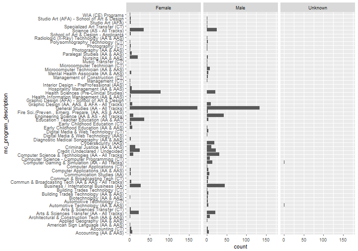

<style>
/* Your other css */
    body {
      background-image: url(https://raw.githubusercontent.com/aarora79/DS_For_HighSchoolers/master/images/background7.png);
      background-position: center center;
      background-attachment: fixed;
      background-repeat: no-repeat;
      background-size: 100% 100%;
      text-color: blue;
    }
.section .reveal .state-background {
    background-image: url(http://goo.gl/yJFbG4);
    background-position: center center;
    background-attachment: fixed;
    background-repeat: no-repeat;
    background-size: 100% 100%;
}
</style>

Lecture 4: Data Science for High Schoolers 
========================================================
author: Amit Arora
date: 2018-01-02
autosize: true

Exploratory Data Analysis
========================================================

 - Ok so we have the data but the raw numbers/text are not very useful.
  - We need quantitative as well as visual description of the data.
 - Going back to why we are wroking with this data? We need answers to questions which we think this data can provide.
 - We need to conduct an <b>exploration</b>...
 - The exploration can be statistical, visual. Usually it is both.
 
Using Statistics to understand the data
========================================================
 - We use *descriptive statistics*.
  - Mean/Median/Quantiles for continous data. For example what is the average number of students each city sends to a community college? What is the 95th percentile/quantile of the same.
   - 95th quantile for example refers to  (in the above example) the number of which is greater than or equal to number of students sent by 95% of the cities. 
- For categorical data, we use mode instead of mean or median. "Mode" is a data value that appers most often. But it is usually more useful to do a frequency count and then sort it rather than to just look at the mode (remember the barplot example).

Using Statistics to understand the data (contd.)
========================================================
- We use the "summary" function in R to get a quick summary.

```
 [1] "age_group"                "attend_day_or_evening"   
 [3] "attending_germantown"     "attending_rockville"     
 [5] "attending_takoma_park_ss" "city_in_md"              
 [7] "county_in_md"             "ethnicity"               
 [9] "fall_term"                "gender"                  
[11] "hs_category"              "mc_program_description"  
[13] "mcps_high_school"         "race"                    
[15] "state"                    "student_status"          
[17] "student_type"             "zip"                     
```

Using Statistics to understand the data (contd.)
========================================================
- Now lets draw some plots that help understand the data. We already drew the barplot. Lets now draw some plots for *derived features* i.e. features/variables/columns that dont exist in the dataset as received but can be **derived**.

```r
library(dplyr)
df_course_by_gender = df %>%
  group_by(gender, mc_program_description) %>%
  summarise(count = n()) %>% arrange(desc(count))
df_course_by_gender
```

```
# A tibble: 86 x 3
# Groups:   gender [3]
   gender                            mc_program_description count
   <fctr>                                            <fctr> <int>
 1 Female                 General Studies (AA - All Tracks)   172
 2   Male                 General Studies (AA - All Tracks)   134
 3 Female            Health Sciences (Pre-Clinical Studies)    78
 4   Male            Business / International Business (AA)    45
 5   Male        Engineering Science (AA & AS - All Tracks)    43
 6 Female          Education / Teacher Education (AA & AAT)    36
 7 Female                         Science (AS - All Tracks)    35
 8   Male Computer Science & Technologies (AA - All Tracks)    31
 9 Female            Business / International Business (AA)    28
10 Female                   Credit (Undeclared / Undecided)    25
# ... with 76 more rows
```

Same information seen via charts
========================================================

```r
library(ggplot2)


p <- df_course_by_gender %>%
  ggplot(aes(x=mc_program_description, y=count)) +
  geom_bar(stat="identity") + coord_flip() + 
  facet_wrap(~gender)
p
```




Code continued..
========================================================

```r
p <- df_course_by_gender %>%
  ggplot(aes(x=reorder(mc_program_description, -count), y=count)) +
  geom_bar(stat="identity") + coord_flip() + 
  facet_wrap(~gender)
p
```


Excecise.
========================================================
Pick another variable annd do similar analysis, generate similar plots

